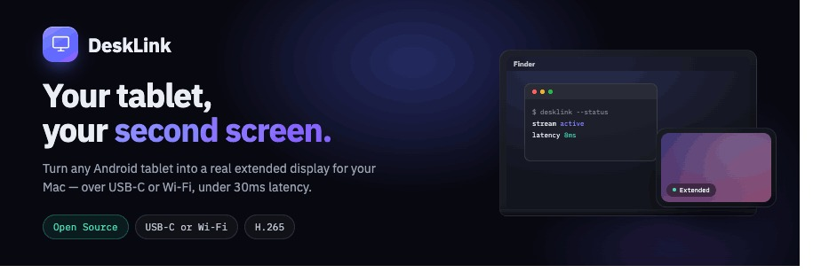

<div align="center">



<br>

### 안드로이드 태블릿을 맥의 진짜 확장 모니터로, USB 또는 Wi-Fi로.

<br>

[](#요구-사항)
&nbsp;
[](#요구-사항)
&nbsp;
[](#구조)
&nbsp;
[](#구조)

<br>

[개요](#개요) · [주요 기능](#주요-기능) · [동작 방식](#동작-방식) · [요구 사항](#요구-사항) · [빌드](#빌드-및-실행) · [구조](#구조) · [FAQ](#faq)

</div>

---

## 개요

**DeskLink**은 두 개의 앱으로 이루어진다. 하나는 **맥의 메뉴바 서버**, 다른 하나는 **안드로이드 클라이언트**다.
둘이 함께 태블릿을 단순 미러링이 아닌 **진짜 두 번째 모니터**로 바꾼다. 맥이 가상 디스플레이를 만들어
그 화면을 캡처하고 하드웨어 H.265(HEVC)로 인코딩해 태블릿으로 스트리밍하면, 태블릿이 이를 디코딩해
보여 주고 터치를 다시 마우스·키보드 입력으로 맥에 되돌린다.

연결은 **USB**(`adb reverse`, PIN 불필요) 또는 로컬 네트워크의 **Wi-Fi**(TLS 암호화, 6자리 PIN)로 이루어지며,
**맥이 항상 서버**다.

> 개인·연구용 프로젝트다. 아직 배포용 패키지는 없고 **소스에서 빌드**해 사용하며, 한 번에 태블릿 한 대를 지원한다.

## 주요 기능

| 기능 | 설명 |
|---|---|
| **진짜 확장 디스플레이** | 내장 화면의 미러가 아니라 별도의 가상 디스플레이. 창을 태블릿으로 끌어다 놓고 시스템 설정에서 일반 모니터처럼 배치할 수 있다. |
| **네이티브 해상도** | 스트리밍 해상도를 태블릿 패널에서 런타임에 그대로 가져온다(예: 3200x2000). 하드코딩된 목록이 아니라 화면과 1:1로 맞고, 원하면 더 낮은 프리셋도 고를 수 있다. |
| **USB 또는 Wi-Fi** | USB는 지연이 가장 낮고 PIN이 필요 없다(포트 포워딩 자동). Wi-Fi는 TLS로 암호화되고 맥에 표시된 6자리 PIN으로 페어링하며, 이후 자동 재연결된다. |
| **스트림 조절** | 해상도, 프레임레이트(30 / 60 / 120), 비트레이트, 코덱(HEVC 또는 H.264)을 태블릿 설정에서 조절한다. |
| **터치와 제스처** | 탭, 드래그, 길게 눌러 우클릭, 두 손가락 스크롤·플링, 핀치 줌·팬(태블릿 로컬). 터치 입력은 꺼서 **보기 전용**으로 둘 수 있다. |
| **화면 회전** | 0 / 90 / 180 / 270. 가로·세로 형상은 맥에서 만들고, 180 뒤집기는 태블릿에서 무손실로 적용한다. |
| **저지연 파이프라인** | 하드웨어 HEVC 인코딩·디코딩에 vsync 정렬 렌더링. |
| **화면 위 컨트롤** | 설정·연결 해제를 위한 드래그 가능한 플로팅 핸들. 태블릿 시스템 제스처와 충돌하지 않는다. |

## 동작 방식

1. **두 앱을 설치한다** — 맥에는 DeskLink 서버, 안드로이드 태블릿에는 클라이언트.
2. **맥 메뉴바에서 서버를 시작**한 뒤 태블릿에서 연결한다. USB-C를 꽂거나, Wi-Fi를 골라 맥에 표시된 6자리 PIN을 입력한다.
3. **바로 스트리밍이 시작**된다. 태블릿이 두 번째 모니터로 동작하고, 터치는 포인터 입력으로 전달된다.

와이어 프로토콜은 길이 접두 프레이밍(`[length: uint32 BE][type: u8][payload]`)이며, 핸드셰이크·설정
메시지는 UTF-8 JSON이다. 전체 명세는 [`docs/protocol-spec.md`](docs/protocol-spec.md)에 있다.

## 요구 사항

- **macOS 14 (Sonoma) 이상** — Apple Silicon 또는 Intel, Swift 툴체인(Xcode 또는 Command Line Tools).
  서버는 **서명된 메뉴바 앱**으로 실행되어 화면 기록·손쉬운 사용 권한이 재빌드해도 유지된다.
- **Android 9.0 (API 28) 이상** — 하드웨어 H.265 디코드 지원.
- 유선은 **USB-C 케이블**, 무선은 두 기기가 **같은 Wi-Fi 네트워크**(5GHz 권장).
- 빌드에는 **JDK 17**과 **Android SDK**(`adb`가 `PATH`에) 필요.

## 빌드 및 실행

두 플랫폼의 권한 프롬프트까지 포함한 전체 절차는 [`docs/INSTALL_AND_PERMISSIONS.md`](docs/INSTALL_AND_PERMISSIONS.md)에 있다. 요약하면:

### macOS 서버

```bash
cd macos/DeskLink
./scripts/create_cert.sh          # 최초 1회: TCC 권한 유지를 위한 서명 신원
./scripts/create_tls_cert.sh      # Wi-Fi를 쓸 때만
./scripts/build_and_run.command   # 빌드 · 서명 · 실행 (또는 build_app.sh)
```

이후 메뉴바 아이콘을 눌러 **Start Server**를 선택한다. 최초 실행 시 시스템 설정에서 **화면 기록**과
**손쉬운 사용**(Wi-Fi는 **로컬 네트워크**도) 권한을 허용한다.

### Android 클라이언트

```bash
cd android
./gradlew :app:installDebug       # 디버그 APK 빌드 + 설치 (JDK 17)
```

먼저 태블릿에서 **USB 디버깅**을 켠다. 서버가 시작될 때 맥이 `adb reverse`를 자동으로 설정하므로
USB는 별도의 포트 포워딩 없이 동작한다.

### 권한 요약

| 플랫폼 | 권한 | 언제 |
|---|---|---|
| macOS | 화면 기록 | 가상 디스플레이 캡처(필수) |
| macOS | 손쉬운 사용 | 터치 → 마우스·키보드 주입(필수) |
| macOS | 로컬 네트워크 | Wi-Fi 모드에서 검색·연결 |
| Android | 주변 기기 | Wi-Fi 모드 서버 검색(USB만 쓰면 불필요) |
| Android | 알림 | 미러링 중 포그라운드 서비스 알림(권장) |

## 구조

두 앱 모두 클린 아키텍처와 단방향 상태 흐름(domain → data → presentation)을 따른다.

- **macOS** — SwiftUI 메뉴바 앱(SwiftPM). 캡처는 ScreenCaptureKit, 가상 모니터는 CGVirtualDisplay,
  HEVC 인코딩은 VideoToolbox, 입력 주입은 CGEvent, 전송은 Network.framework를 사용한다.
- **Android** — Jetpack Compose + Hilt. HEVC 디코딩은 MediaCodec, 렌더링은 SurfaceView를 사용한다.

와이어 프로토콜은 [`docs/protocol-spec.md`](docs/protocol-spec.md)에 문서화되어 있고,
[`tools/protocol_vectors.py`](tools/protocol_vectors.py)의 골든 벡터로 검증한다.

```text
android/   안드로이드 클라이언트 (Kotlin · Compose · Hilt)
macos/     macOS 서버 (Swift · SwiftPM)
docs/      프로토콜 명세, 설치 가이드, 디자인·아이콘 자산
tools/     프로토콜 골든 벡터 검사
```

## FAQ

<details>
<summary><b>미러링과 뭐가 다른가?</b></summary>

미러가 아니라 **별도의 가상 디스플레이**를 만든다. 맥 화면을 복제하는 게 아니라 새 모니터가 하나
생기는 것이므로, 창을 태블릿으로 끌어다 놓고 독립적으로 배치할 수 있다.
</details>

<details>
<summary><b>USB와 Wi-Fi 중 무엇을 써야 하나?</b></summary>

**USB**가 지연이 가장 낮고 PIN도 필요 없어 기본 권장이다. **Wi-Fi**는 선이 필요 없는 대신 맥에 표시된
6자리 PIN으로 한 번 페어링해야 하며, 신호에 따라 지연이 늘 수 있다(5GHz 권장).
</details>

<details>
<summary><b>공용 Wi-Fi에서 안전한가?</b></summary>

Wi-Fi 트래픽은 **TLS로 암호화**되고 올바른 PIN을 가진 기기만 연결된다.
</details>

<details>
<summary><b>태블릿을 세로로 쓸 수 있나?</b></summary>

가능하다. 설정에서 회전(0 / 90 / 180 / 270)을 고르면 세로 형상은 맥이 그 비율로 만들어 보내고,
180 뒤집기는 태블릿에서 무손실로 적용된다.
</details>

<details>
<summary><b>iPad도 되나?</b></summary>

현재는 안드로이드 태블릿만 지원한다.
</details>

## 라이선스

아직 라이선스 파일이 추가되어 있지 않다.

<div align="center">
<br>
<sub>화면이 늘 부족한 사람을 위해.</sub>
</div>
