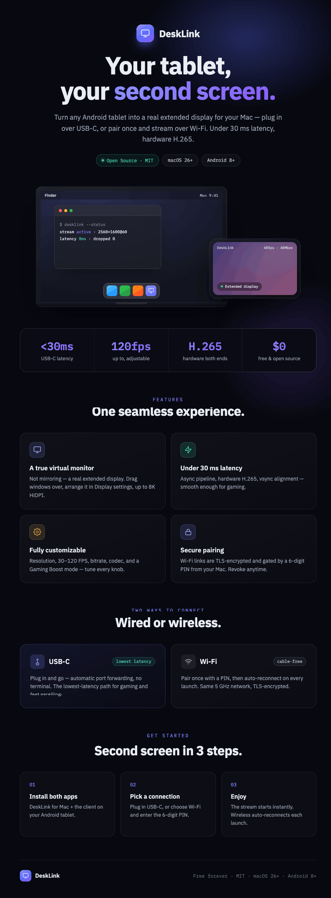

## 문서

| 문서 | 내용 |
|------|------|
| [초기 환경 셋업](docs/setup.md) | 새 Mac · 태블릿 · 개발 머신에서 처음부터 동작시키는 절차 (권한, 인증서, 설치 스크립트) |
| [빌드 · 설치 · 테스트](docs/BUILD_AND_TEST.md) | 빌드 명령, 테스트 커버리지, 수동 시나리오 |
| [프로토콜 스펙](docs/protocol-spec.md) | 와이어 프로토콜 정본 |

처음 셋업하는 경우 [docs/setup.md](docs/setup.md)부터 본다.
