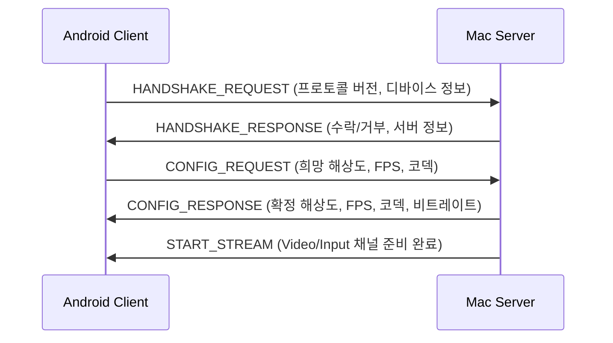

# DeskLink Protocol Specification v1.0

## 개요

Mac 서버와 Android 클라이언트 간 통신 프로토콜 정의.
모든 멀티바이트 값은 **Big-Endian** 바이트 순서를 사용한다.

---

## 1. 통신 채널

| 채널 | 용도 | 전송 방식 | 기본 포트 |
|------|------|-----------|-----------|
| Control | 핸드셰이크, 설정 협상, 상태 제어 | TCP | 7100 |
| Video | HEVC 인코딩 프레임 스트림 | TCP | 7101 |
| Input | 터치/입력 이벤트 역전송 | TCP | 7102 |

USB 모드에서는 ADB **reverse** 터널로 연결한다. Mac이 서버(리슨)이고 Android가 `127.0.0.1`로 접속하는 클라이언트이므로 `adb reverse`(device→host)를 사용한다:
```bash
adb reverse tcp:7100 tcp:7100   # Control
adb reverse tcp:7101 tcp:7101   # Video
adb reverse tcp:7102 tcp:7102   # Input
```

---

## 2. 패킷 프레이밍 (공통)

모든 채널은 동일한 프레이밍 구조를 사용한다:

```
+----------------+-------------+------------------+
| Length (4byte) | Type (1byte)| Payload (N byte) |
+----------------+-------------+------------------+
```

| 필드 | 크기 | 설명 |
|------|------|------|
| Length | 4 bytes (uint32) | Type + Payload의 총 바이트 수 |
| Type | 1 byte (uint8) | 메시지 타입 코드 |
| Payload | 가변 | 메시지 본문 |

최대 패킷 크기: 4MB (4,194,304 bytes)

---

## 3. Control 채널 메시지

### 3.1 메시지 타입

| Type Code | 이름 | 방향 | 설명 |
|-----------|------|------|------|
| 0x01 | HANDSHAKE_REQUEST | Client → Server | 연결 요청 |
| 0x02 | HANDSHAKE_RESPONSE | Server → Client | 연결 응답 |
| 0x03 | CONFIG_REQUEST | Client → Server | 설정 변경 요청 |
| 0x04 | CONFIG_RESPONSE | Server → Client | 설정 변경 응답 |
| 0x05 | START_STREAM | Server → Client | 스트림 시작 알림 |
| 0x06 | STOP_STREAM | 양방향 | 스트림 중단 |
| 0x07 | PING | 양방향 | 연결 유지 확인 |
| 0x08 | PONG | 양방향 | Ping 응답 |
| 0x09 | ERROR | 양방향 | 에러 보고 |
| 0x0A | DISCONNECT | 양방향 | 정상 종료 |
| 0x0B | BITRATE_UPDATE | Server → Client | 비트레이트 변경 통보 |
| 0x0C | CONFIG_UPDATE | 양방향 | 스트림 중 설정 변경 요청 |
| 0x0D | AUTH_CHALLENGE | Server → Client | LAN 인증: 서버 nonce (TLS 내부, USB는 미사용) |
| 0x0E | AUTH_RESPONSE | Client → Server | LAN 인증: 클라이언트 nonce + 증명 |
| 0x0F | AUTH_CONFIRM | Server → Client | LAN 인증: 서버 증명 |

### 3.1a LAN 상호 인증 (0x0D–0x0F, WiFi 전용)

USB(loopback)에는 적용하지 않는다. WiFi(LAN)에서 TLS 채널이 맺어진 뒤, 핸드셰이크
(0x01) 앞단에 PIN 기반 상호 인증을 수행한다. 페어링 키 `K = HKDF-SHA256(PIN)`
(§pairing_vectors.py)를 양쪽이 보유하며, PIN/키 자체는 전송하지 않는다.

증명 = `HMAC-SHA256(K, context || serverNonce || clientNonce)`. 방향별 context로
역방향 재사용을 차단한다:
- 클라이언트: `"desklink-auth-client"`
- 서버: `"desklink-auth-server"`

흐름:
1. Server → **AUTH_CHALLENGE**: `serverNonce`(16B 랜덤).
2. Client → **AUTH_RESPONSE**: `clientNonce`(16B) + `clientProof`(32B).
3. Server가 `clientProof` 검증(상수 시간). 실패 시 연결 종료 + 실패 카운트 증가(잠금).
4. Server → **AUTH_CONFIRM**: `serverProof`(32B). Client가 검증 후 핸드셰이크로 진행.

3자(Python/Swift/Kotlin) 골든 벡터는 `tools/protocol_vectors.py`의 `AUTH_*`에 있으며
"ALL CHECKS PASS"를 유지한다. 프레이밍은 공통 `[len u32 BE][type u8][payload]` 그대로다.

### 3.2 핸드셰이크 흐름



### 3.3 HANDSHAKE_REQUEST (0x01)

Payload: JSON (UTF-8)

```json
{
  "protocolVersion": 1,
  "clientName": "DeskLink Android",
  "clientVersion": "1.0.0",
  "deviceModel": "Xiaoxin Pad 11.1 GT Pro",
  "osVersion": "Android 14",
  "screenWidth": 2560,
  "screenHeight": 1600,
  "maxFps": 120,
  "supportedCodecs": ["hevc", "h264"],
  "touchSupport": true,
  "multiTouchMaxPoints": 10
}
```

### 3.4 HANDSHAKE_RESPONSE (0x02)

Payload: JSON (UTF-8)

```json
{
  "protocolVersion": 1,
  "accepted": true,
  "serverName": "DeskLink Mac",
  "serverVersion": "1.0.0",
  "osVersion": "macOS 26.0",
  "rejectReason": null
}
```

### 3.5 CONFIG_REQUEST (0x03)

Payload: JSON (UTF-8)

```json
{
  "width": 2560,
  "height": 1600,
  "fps": 60,
  "codec": "hevc",
  "bitrateKbps": 20000
}
```

### 3.6 CONFIG_RESPONSE (0x04)

Payload: JSON (UTF-8)

```json
{
  "accepted": true,
  "width": 2560,
  "height": 1600,
  "fps": 60,
  "codec": "hevc",
  "bitrateKbps": 20000,
  "keyframeInterval": 2
}
```

### 3.7 PING / PONG (0x07, 0x08)

Payload: 8 bytes (int64) — 전송 시각 타임스탬프 (밀리초, Unix epoch)

PING 간격: 1초. 연결 끊김 판단 로직:
- 마지막으로 성공한 PONG 수신 시각을 기록한다.
- 현재 시각 - 마지막 PONG 시각 > `PING_TIMEOUT(3초)` 이면 연결 끊김으로 판단한다.
- 즉, PONG이 3초간 하나도 오지 않으면 끊김이다 (PING 3회분에 해당).

### 3.8 BITRATE_UPDATE (0x0B)

서버가 적응형 비트레이트 조절 시 클라이언트에 통보한다. 스트림 중단 없이 전송된다.

Payload: JSON (UTF-8)

```json
{
  "bitrateKbps": 15000,
  "reason": "bandwidth_low"
}
```

reason 값: `"bandwidth_low"`, `"bandwidth_high"`, `"cpu_high"`, `"manual"`

### 3.9 CONFIG_UPDATE (0x0C)

스트림 진행 중에도 설정 변경이 가능하다. CONFIG_REQUEST/CONFIG_RESPONSE와 동일한 페이로드를 사용하되, 스트림을 중단하지 않고 적용된다. 해상도 변경 시에는 스트림 재시작이 필요하므로 STOP_STREAM → CONFIG → START_STREAM 시퀀스를 사용한다.

### 3.10 ERROR (0x09)

Payload: JSON (UTF-8)

```json
{
  "code": 1001,
  "message": "Encoder failed to initialize"
}
```

에러 코드 범위:

| 범위 | 카테고리 |
|------|----------|
| 1000-1099 | 연결 에러 |
| 1100-1199 | 인코딩/디코딩 에러 |
| 1200-1299 | 디스플레이 에러 |
| 1300-1399 | 입력 에러 |
| 1400-1499 | 설정 에러 |

---

## 4. Video 채널 메시지

### 4.1 메시지 타입

| Type Code | 이름 | 설명 |
|-----------|------|------|
| 0x10 | VIDEO_FRAME | 인코딩된 비디오 프레임 |
| 0x11 | VIDEO_CONFIG | 코덱 설정 데이터 (SPS/PPS/VPS) |
| 0x12 | KEYFRAME_REQUEST | 키프레임 요청 (Client → Server) |

### 4.2 VIDEO_CONFIG (0x11)

스트림 시작 시 첫 번째로 전송. 디코더 초기화에 필요.

Payload:

```
+-------------------+-----------------+-----------+
| Codec ID (1 byte) | Config Length   | Config    |
|                    | (2 bytes)       | Data      |
+-------------------+-----------------+-----------+
```

| Codec ID | 코덱 |
|----------|------|
| 0x01 | H.265 (HEVC) |
| 0x02 | H.264 (AVC) |

Config Data: CSD (Codec Specific Data) — HEVC의 경우 VPS+SPS+PPS

### 4.3 VIDEO_FRAME (0x10)

Payload:

```
+---------------------+------------------+-----------------+----------+
| Timestamp (8 bytes) | Flags (1 byte)   | Frame Number    | NAL Data |
| int64, microseconds | bit field        | (4 bytes uint32)|          |
+---------------------+------------------+-----------------+----------+
```

Flags 비트 필드:

| Bit | 이름 | 설명 |
|-----|------|------|
| 0 | IS_KEYFRAME | 1이면 키프레임 (IDR) |
| 1 | IS_CONFIG | 1이면 코덱 설정 변경 포함 |
| 2-7 | Reserved | 미사용, 0 |

---

## 5. Input 채널 메시지

### 5.1 메시지 타입

| Type Code | 이름 | 방향 | 설명 |
|-----------|------|------|------|
| 0x20 | TOUCH_EVENT | Client → Server | 터치 이벤트 |
| 0x21 | TOUCH_BATCH | Client → Server | 터치 이벤트 배치 |
| 0x22 | SCROLL | Client → Server | 스크롤(두 손가락 드래그) |
| 0x23 | POINTER_BUTTON | Client → Server | 포인터 버튼(좌/우) 누름/뗌 — 롱프레스 우클릭 |

### 5.2 TOUCH_EVENT (0x20)

Payload (고정 20 bytes):

```
+------------+----------+----------+--------------+---------------+
| Action     | X        | Y        | Pressure     | Pointer ID    |
| (1 byte)   | (4 bytes | (4 bytes | (2 bytes     | (1 byte       |
|            | float32) | float32) | uint16 0-65535) | uint8 0-9) |
+------------+----------+----------+--------------+---------------+
| Timestamp  |
| (8 bytes   |
| int64 us)  |
+------------+
```

- 터치 데이터: 12 bytes (Action 1 + X 4 + Y 4 + Pressure 2 + PointerID 1)
- 타임스탬프: 8 bytes
- 합계: 20 bytes

Action 값:

| 값 | 이름 | 설명 |
|----|------|------|
| 0x00 | DOWN | 터치 시작 |
| 0x01 | UP | 터치 종료 |
| 0x02 | MOVE | 터치 이동 |
| 0x03 | CANCEL | 터치 취소 |

X, Y 좌표: 0.0 ~ 1.0 정규화 좌표 (가상 디스플레이 해상도 대비 비율)

> **guide.md 원본과의 차이점**: guide.md에서는 X/Y를 4바이트 정수, Timestamp 필드 없이 정의했으나,
> 본 스펙에서는 해상도 독립성을 위해 float32 정규화 좌표를 채택하고, 레이턴시 측정을 위해 Timestamp를 추가했다.
> guide.md의 터치 포맷은 이 스펙을 정본으로 갱신한다.

### 5.3 TOUCH_BATCH (0x21)

여러 터치 이벤트를 묶어서 전송 (네트워크 효율화).

Payload:

```
+-------------+---------------------------+
| Count       | TOUCH_EVENT[0..Count-1]   |
| (2 bytes    | (20 bytes × Count)        |
| uint16)     |                           |
+-------------+---------------------------+
```

최대 Count: 100

### 5.4 SCROLL (0x22)

두 손가락 드래그 스크롤. 정규화 델타(뷰/디스플레이 대비 비율)로 전송하며, 서버가
디스플레이 크기(points)로 환산해 픽셀 스크롤 이벤트로 주입한다.

Payload (고정 8 bytes):

```
+------------+------------+
| DeltaX     | DeltaY     |
| (4 bytes   | (4 bytes   |
| float32)   | float32)   |
+------------+------------+
```

- DeltaX > 0: 손가락이 오른쪽으로 이동. DeltaY > 0: 손가락이 아래로 이동.
- 서버는 받은 델타에 natural 부호(콘텐츠가 손가락을 따라감)를 적용해 픽셀 스크롤로 주입한다.
- 스크롤 감도(배율)와 방향(Natural/Reversed)은 클라이언트가 전송 전에 델타에 적용한다.
  Reversed는 클라이언트가 부호를 반전해 보내므로 서버는 변경 없이 그대로 주입한다.

### 5.5 POINTER_BUTTON (0x23)

포인터 버튼의 누름/뗌을 지정 위치에서 주입한다. 한 손가락 롱프레스를 우클릭으로
매핑하는 데 사용한다(클라이언트가 DOWN, UP 두 메시지를 연속 전송 = 한 번의 클릭).
좌표는 TOUCH_EVENT와 동일한 정규화(0..1) 규칙을 따른다.

Payload (고정 10 bytes):

```
+------------+------------+------------+------------+
| Button     | Action     | X          | Y          |
| (1 byte)   | (1 byte)   | (4 bytes   | (4 bytes   |
|            |            | float32)   | float32)   |
+------------+------------+------------+------------+
```

Button 값:

| 값 | 이름 |
|----|------|
| 0x00 | LEFT |
| 0x01 | RIGHT |

Action 값:

| 값 | 이름 | 설명 |
|----|------|------|
| 0x00 | DOWN | 버튼 누름 |
| 0x01 | UP | 버튼 뗌 |

X, Y 좌표: 0.0 ~ 1.0 정규화 좌표 (가상 디스플레이 해상도 대비 비율).

---

## 6. 에러 코드 정의

| 코드 | 이름 | 설명 |
|------|------|------|
| 1000 | CONNECTION_REFUSED | 서버가 연결 거부 |
| 1001 | PROTOCOL_MISMATCH | 프로토콜 버전 불일치 |
| 1002 | TIMEOUT | 응답 시간 초과 |
| 1003 | CONNECTION_LOST | 연결 끊김 |
| 1100 | ENCODER_INIT_FAILED | 인코더 초기화 실패 |
| 1101 | ENCODER_FAILED | 인코딩 중 오류 |
| 1102 | DECODER_INIT_FAILED | 디코더 초기화 실패 |
| 1103 | DECODER_FAILED | 디코딩 중 오류 |
| 1104 | CODEC_NOT_SUPPORTED | 지원하지 않는 코덱 |
| 1200 | DISPLAY_CREATE_FAILED | 가상 디스플레이 생성 실패 |
| 1201 | DISPLAY_CAPTURE_FAILED | 화면 캡처 실패 |
| 1202 | DISPLAY_RESOLUTION_INVALID | 잘못된 해상도 |
| 1300 | INPUT_INJECTION_FAILED | 입력 주입 실패 |
| 1301 | INPUT_PERMISSION_DENIED | 입력 권한 없음 |
| 1400 | CONFIG_INVALID | 잘못된 설정 값 |
| 1401 | CONFIG_NEGOTIATION_FAILED | 설정 협상 실패 |

---

## 7. 타이밍 상수

| 상수 | 값 | 설명 |
|------|-----|------|
| HANDSHAKE_TIMEOUT | 5,000 ms | 핸드셰이크 완료 제한 시간 |
| PING_INTERVAL | 1,000 ms | Ping 전송 간격 |
| PING_TIMEOUT | 3,000 ms | Pong 응답 대기 시간 |
| RECONNECT_DELAY | 1,000 ms | 재연결 초기 대기 시간 |
| RECONNECT_MAX_DELAY | 30,000 ms | 재연결 최대 대기 시간 (지수 백오프) |
| RECONNECT_MAX_ATTEMPTS | 10 | 최대 재연결 시도 횟수 |
| STREAM_START_TIMEOUT | 3,000 ms | 스트림 시작 대기 시간 |

---

## 8. ADB 포트 포워딩 명령

> **중요**: Mac이 **서버**(7100~7102 리슨)이고 Android가 `127.0.0.1:PORT`로 접속하는 **클라이언트**이므로,
> `adb forward`(host→device)가 아니라 **`adb reverse`(device→host)** 를 사용한다. `adb forward`는 서버가 기기에 있을 때 쓰는 방향이라 이 구조에서는 연결되지 않는다.

```bash
# USB 연결 시 reverse 터널 설정 (adb reverse tcp:<devicePort> tcp:<hostPort>)
adb reverse tcp:7100 tcp:7100   # Control
adb reverse tcp:7101 tcp:7101   # Video
adb reverse tcp:7102 tcp:7102   # Input

# reverse 터널 해제
adb reverse --remove tcp:7100
adb reverse --remove tcp:7101
adb reverse --remove tcp:7102

# 전체 해제
adb reverse --remove-all

# 터널 목록 확인
adb reverse --list
```

Android 클라이언트가 `127.0.0.1:PORT`로 연결하면, `adb reverse`가 기기의 해당 포트를 USB를 통해 Mac 서버로 터널링한다.

---

## 9. 성능 요구사항

| 항목 | USB 목표 | Wi-Fi 목표 |
|------|----------|------------|
| E2E 레이턴시 | ≤ 30ms | ≤ 60ms |
| 프레임레이트 | 60fps (120fps Gaming) | 60fps |
| 최대 해상도 | 2560×1600 | 1920×1200 |
| 비트레이트 | 20-40 Mbps | 10-20 Mbps |
| Mac CPU | ≤ 10% | ≤ 10% |
| Android CPU | ≤ 15% | ≤ 15% |

TCP 소켓 옵션:
- `TCP_NODELAY`: 활성화 (Nagle 알고리즘 비활성화)
- `SO_SNDBUF` / `SO_RCVBUF`: 2MB
- `SO_KEEPALIVE`: 활성화
