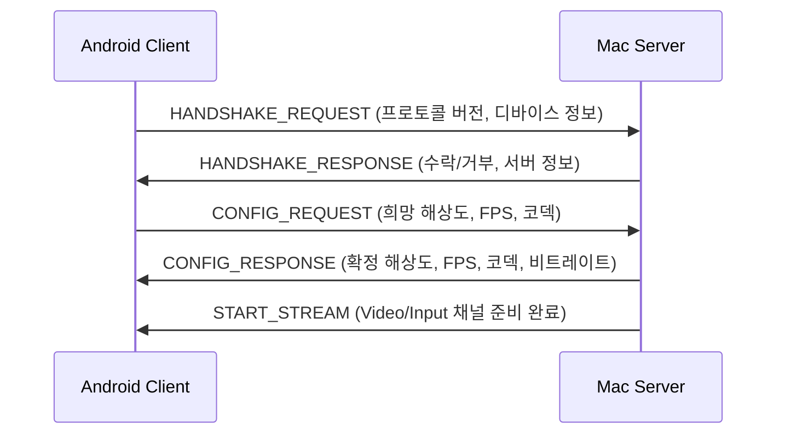

# DeskLink Protocol Specification v1.0

## 개요

Mac 서버와 Android 클라이언트 간 통신 프로토콜 정의.
모든 멀티바이트 값은 **Big-Endian** 바이트 순서를 사용한다.

---

## 1. 통신 채널

Mac은 전송 방식별로 **독립된 리스너 스택**을 동시에 운영한다. USB 스택은 항상 켜져 있고
(loopback, 평문, PIN 없음), Wi‑Fi를 켜면 LAN 스택(전 인터페이스, TLS, PIN 페어링)이 함께
뜬다. 두 스택이 동시에 리슨하므로 Wi‑Fi가 켜져 있어도 USB는 PIN 없이 즉시 연결된다. 클라이언트는
어느 소켓(포트)에 접속했는지로 전송 방식이 결정되며, 이는 클라이언트가 위조할 수 없다.

| 채널 | 용도 | 전송 방식 | USB 포트 | LAN 포트 |
|------|------|-----------|----------|----------|
| Control | 핸드셰이크, 설정 협상, 상태 제어 | TCP | 7100 | 7110 |
| Video | HEVC 인코딩 프레임 스트림 | TCP | 7101 | 7111 |
| Input | 터치/입력 이벤트 역전송 | TCP | 7102 | 7112 |
| Audio | 맥 시스템 오디오 PCM 스트림 | TCP | 7103 | 7113 |

USB 스택은 평문·무인증(케이블이 신뢰 경계), LAN 스택은 TLS + PIN 상호 인증이다. USB 모드에서는
ADB **reverse** 터널로 연결한다. Mac이 서버(리슨)이고 Android가 `127.0.0.1`로 접속하는 클라이언트이므로 `adb reverse`(device→host)를 사용한다:
```bash
adb reverse tcp:7100 tcp:7100   # Control
adb reverse tcp:7101 tcp:7101   # Video
adb reverse tcp:7102 tcp:7102   # Input
adb reverse tcp:7103 tcp:7103   # Audio
```

Audio 채널은 현재 **USB에서만** 동작한다. 무압축 PCM(약 1.5 Mbps)이라 Wi‑Fi에는 부적합하며,
LAN 포트(7113)는 코덱이 생길 때를 위해 예약만 되어 있다.

---

## 2. 패킷 프레이밍 (공통)

모든 채널은 동일한 프레이밍 구조를 사용한다:

```
+----------------+-------------+------------------+
| Length (4byte) | Type (1byte)| Payload (N byte) |
+----------------+-------------+------------------+
```

| 필드 | 크기 | 설명 |
|------|------|------|
| Length | 4 bytes (uint32) | Type + Payload의 총 바이트 수 |
| Type | 1 byte (uint8) | 메시지 타입 코드 |
| Payload | 가변 | 메시지 본문 |

최대 패킷 크기: 4MB (4,194,304 bytes)

---

## 3. Control 채널 메시지

### 3.1 메시지 타입

| Type Code | 이름 | 방향 | 설명 |
|-----------|------|------|------|
| 0x01 | HANDSHAKE_REQUEST | Client → Server | 연결 요청 |
| 0x02 | HANDSHAKE_RESPONSE | Server → Client | 연결 응답 |
| 0x03 | CONFIG_REQUEST | Client → Server | 설정 변경 요청 |
| 0x04 | CONFIG_RESPONSE | Server → Client | 설정 변경 응답 |
| 0x05 | START_STREAM | Server → Client | 스트림 시작 알림 |
| 0x06 | STOP_STREAM | 양방향 | 스트림 중단 |
| 0x07 | PING | 양방향 | 연결 유지 확인 |
| 0x08 | PONG | 양방향 | Ping 응답 |
| 0x09 | ERROR | 양방향 | 에러 보고 |
| 0x0A | DISCONNECT | 양방향 | 정상 종료 |
| 0x0B | BITRATE_UPDATE | Server → Client | 비트레이트 변경 통보 |
| 0x0C | CONFIG_UPDATE | 양방향 | 스트림 중 설정 변경 요청 |
| 0x0D | AUTH_CHALLENGE | Server → Client | LAN 인증: 서버 nonce (TLS 내부, USB는 미사용) |
| 0x0E | AUTH_RESPONSE | Client → Server | LAN 인증: 클라이언트 nonce + 증명 |
| 0x0F | AUTH_CONFIRM | Server → Client | LAN 인증: 서버 증명 |

### 3.1a LAN 상호 인증 (0x0D–0x0F, WiFi 전용)

USB(loopback)에는 적용하지 않는다. WiFi(LAN)에서 TLS 채널이 맺어진 뒤, 핸드셰이크
(0x01) 앞단에 PIN 기반 상호 인증을 수행한다. 페어링 키 `K = HKDF-SHA256(PIN)`
(§pairing_vectors.py)를 양쪽이 보유하며, PIN/키 자체는 전송하지 않는다.

증명 = `HMAC-SHA256(K, context || serverNonce || clientNonce)`. 방향별 context로
역방향 재사용을 차단한다:
- 클라이언트: `"desklink-auth-client"`
- 서버: `"desklink-auth-server"`

흐름:
1. Server → **AUTH_CHALLENGE**: `serverNonce`(16B 랜덤).
2. Client → **AUTH_RESPONSE**: `clientNonce`(16B) + `clientProof`(32B).
3. Server가 `clientProof` 검증(상수 시간). 실패 시 연결 종료 + 실패 카운트 증가(잠금).
4. Server → **AUTH_CONFIRM**: `serverProof`(32B). Client가 검증 후 핸드셰이크로 진행.

3자(Python/Swift/Kotlin) 골든 벡터는 `tools/protocol_vectors.py`의 `AUTH_*`에 있으며
"ALL CHECKS PASS"를 유지한다. 프레이밍은 공통 `[len u32 BE][type u8][payload]` 그대로다.

### 3.2 핸드셰이크 흐름


```mermaid
sequenceDiagram
    participant C as Android Client
    participant S as Mac Server

    C->>S: HANDSHAKE_REQUEST (프로토콜 버전, 디바이스 정보)
    S->>C: HANDSHAKE_RESPONSE (수락/거부, 서버 정보)
    C->>S: CONFIG_REQUEST (희망 해상도, FPS, 코덱)
    S->>C: CONFIG_RESPONSE (확정 해상도, FPS, 코덱, 비트레이트)
    S->>C: START_STREAM (Video/Input 채널 준비 완료)
```

### 3.3 HANDSHAKE_REQUEST (0x01)

Payload: JSON (UTF-8)

```json
{
  "protocolVersion": 1,
  "clientName": "DeskLink Android",
  "clientVersion": "1.0.0",
  "deviceModel": "Xiaoxin Pad 11.1 GT Pro",
  "osVersion": "Android 14",
  "screenWidth": 2560,
  "screenHeight": 1600,
  "maxFps": 120,
  "supportedCodecs": ["hevc", "h264"],
  "touchSupport": true,
  "multiTouchMaxPoints": 10
}
```

### 3.4 HANDSHAKE_RESPONSE (0x02)

Payload: JSON (UTF-8)

```json
{
  "protocolVersion": 1,
  "accepted": true,
  "serverName": "DeskLink Mac",
  "serverVersion": "1.0.0",
  "osVersion": "macOS 26.0",
  "rejectReason": null
}
```

`displayMode`는 서버가 **확장(extend)** 으로 스트리밍 중인지 **미러(mirror)** 중인지 알린다.

| 값 | 의미 | 입력 |
|----|------|------|
| `extend` | 맥에 가상 디스플레이를 추가해 그 화면을 보낸다 | 허용 |
| `mirror` | 맥의 기존 화면을 그대로 보낸다 | **거부** |

미러에서 입력을 거부하는 이유는 그 터치가 맥을 쓰고 있는 사람의 커서를 움직이기 때문이다.
서버는 미러 모드에서 **Input 포트를 바인드조차 하지 않는다** — 모드를 무시하는 클라이언트도
주입할 수 없어야 하므로, 클라이언트가 보내지 않는 것에 의존하지 않는다.

클라이언트는 이 값을 보고 (1) 미러면 Input 채널을 열지 않고 (2) 터치가 꺼진 이유를 화면에
표시해야 한다. 표시가 없으면 반응하지 않는 화면이 고장으로 읽힌다.

필드가 없으면 `extend`로 간주한다(구버전 서버 호환).

모드는 **맥이 소유한다**. 확장은 맥의 디스플레이 배치를 바꾸고(창이 이동한다), 입력 수용 여부는
서버가 스스로 판단해야 하는 사안이라 클라이언트가 통보할 수 없다.

전환에는 **세션 재시작이 필요하다**. `VIDEO_CONFIG`(0x11)는 코덱과 CSD만 나르고 해상도를
나르지 않으므로, 클라이언트가 새 크기를 아는 경로는 핸드셰이크뿐이다. 미러와 확장은 캡처
크기가 다르니 디코더 재설정이 불가피하고, 따라서 끊김 없는 전환은 이 프로토콜에서 성립하지
않는다. 서버는 사용자가 모드를 바꾸면 스스로 세션을 재시작하고, 클라이언트는 기존 재연결
경로로 붙어 새 `displayMode`를 받는다. 클라이언트가 재연결을 포기하는 시간(§reconnect) 안에
사람이 버튼을 두 번 누르도록 요구하지 않는 것이 이 설계의 목적이다.

### 3.5 CONFIG_REQUEST (0x03)

Payload: JSON (UTF-8)

```json
{
  "width": 2560,
  "height": 1600,
  "fps": 60,
  "codec": "hevc",
  "bitrateKbps": 20000
}
```

`width`/`height`는 요청 화면 방향을 그대로 담는다. 세로(portrait) 요청은 `height > width`로
보낸다. 서버는 방향을 보존한 채 태블릿 패널에 맞춰 클램프한다: 요청의 긴 변은 패널의 긴 변,
짧은 변은 패널의 짧은 변에 각각 `min`으로 맞춘다(축별 단순 `min`이 아니다 — 세로 요청의
height가 가로 패널 height로 깎여 왜곡되는 것을 막기 위함). 별도의 orientation 필드는 없으며
방향은 dims로만 표현한다. 화면의 상하 반전(180 플립)은 태블릿에서만 처리하고 이 프로토콜로는
전달하지 않는다.

### 3.6 CONFIG_RESPONSE (0x04)

Payload: JSON (UTF-8)

```json
{
  "accepted": true,
  "width": 2560,
  "height": 1600,
  "fps": 60,
  "codec": "hevc",
  "bitrateKbps": 20000,
  "keyframeInterval": 2
}
```

### 3.7 PING / PONG (0x07, 0x08)

Payload: 8 bytes (int64) — 전송 시각 타임스탬프 (밀리초, Unix epoch)

PING 간격: 1초. 연결 끊김 판단 로직:
- 마지막으로 성공한 PONG 수신 시각을 기록한다.
- 현재 시각 - 마지막 PONG 시각 > `PING_TIMEOUT(3초)` 이면 연결 끊김으로 판단한다.
- 즉, PONG이 3초간 하나도 오지 않으면 끊김이다 (PING 3회분에 해당).

### 3.8 BITRATE_UPDATE (0x0B)

서버가 적응형 비트레이트 조절 시 클라이언트에 통보한다. 스트림 중단 없이 전송된다.

Payload: JSON (UTF-8)

```json
{
  "bitrateKbps": 15000,
  "reason": "bandwidth_low"
}
```

reason 값: `"bandwidth_low"`, `"bandwidth_high"`, `"cpu_high"`, `"manual"`

### 3.9 CONFIG_UPDATE (0x0C)

스트림 진행 중에도 설정 변경이 가능하다. CONFIG_REQUEST/CONFIG_RESPONSE와 동일한 페이로드를 사용하되, 스트림을 중단하지 않고 적용된다. 해상도 변경 시에는 스트림 재시작이 필요하므로 STOP_STREAM → CONFIG → START_STREAM 시퀀스를 사용한다.

### 3.10 ERROR (0x09)

Payload: JSON (UTF-8)

```json
{
  "code": 1001,
  "message": "Encoder failed to initialize"
}
```

에러 코드 범위:

| 범위 | 카테고리 |
|------|----------|
| 1000-1099 | 연결 에러 |
| 1100-1199 | 인코딩/디코딩 에러 |
| 1200-1299 | 디스플레이 에러 |
| 1300-1399 | 입력 에러 |
| 1400-1499 | 설정 에러 |

---

## 4. Video 채널 메시지

### 4.1 메시지 타입

| Type Code | 이름 | 설명 |
|-----------|------|------|
| 0x10 | VIDEO_FRAME | 인코딩된 비디오 프레임 |
| 0x11 | VIDEO_CONFIG | 코덱 설정 데이터 (SPS/PPS/VPS) |
| 0x12 | KEYFRAME_REQUEST | 키프레임 요청 (Client → Server) |

### 4.2 VIDEO_CONFIG (0x11)

스트림 시작 시 첫 번째로 전송. 디코더 초기화에 필요.

Payload:

```
+-------------------+-----------------+-----------+
| Codec ID (1 byte) | Config Length   | Config    |
|                    | (2 bytes)       | Data      |
+-------------------+-----------------+-----------+
```

| Codec ID | 코덱 |
|----------|------|
| 0x01 | H.265 (HEVC) |
| 0x02 | H.264 (AVC) |

Config Data: CSD (Codec Specific Data) — HEVC의 경우 VPS+SPS+PPS

### 4.3 VIDEO_FRAME (0x10)

Payload:

```
+---------------------+------------------+-----------------+----------+
| Timestamp (8 bytes) | Flags (1 byte)   | Frame Number    | NAL Data |
| int64, microseconds | bit field        | (4 bytes uint32)|          |
+---------------------+------------------+-----------------+----------+
```

Flags 비트 필드:

| Bit | 이름 | 설명 |
|-----|------|------|
| 0 | IS_KEYFRAME | 1이면 키프레임 (IDR) |
| 1 | IS_CONFIG | 1이면 코덱 설정 변경 포함 |
| 2-7 | Reserved | 미사용, 0 |

---

## 5. Input 채널 메시지

### 5.1 메시지 타입

| Type Code | 이름 | 방향 | 설명 |
|-----------|------|------|------|
| 0x20 | TOUCH_EVENT | Client → Server | 터치 이벤트 |
| 0x21 | TOUCH_BATCH | Client → Server | 터치 이벤트 배치 |
| 0x22 | SCROLL | Client → Server | 스크롤(두 손가락 드래그) |
| 0x23 | POINTER_BUTTON | Client → Server | 포인터 버튼(좌/우) 누름/뗌 — 롱프레스 우클릭 |

### 5.2 TOUCH_EVENT (0x20)

Payload (고정 20 bytes):

```
+------------+----------+----------+--------------+---------------+
| Action     | X        | Y        | Pressure     | Pointer ID    |
| (1 byte)   | (4 bytes | (4 bytes | (2 bytes     | (1 byte       |
|            | float32) | float32) | uint16 0-65535) | uint8 0-9) |
+------------+----------+----------+--------------+---------------+
| Timestamp  |
| (8 bytes   |
| int64 us)  |
+------------+
```

- 터치 데이터: 12 bytes (Action 1 + X 4 + Y 4 + Pressure 2 + PointerID 1)
- 타임스탬프: 8 bytes
- 합계: 20 bytes

Action 값:

| 값 | 이름 | 설명 |
|----|------|------|
| 0x00 | DOWN | 터치 시작 |
| 0x01 | UP | 터치 종료 |
| 0x02 | MOVE | 터치 이동 |
| 0x03 | CANCEL | 터치 취소 |

X, Y 좌표: 0.0 ~ 1.0 정규화 좌표 (가상 디스플레이 해상도 대비 비율)

> **guide.md 원본과의 차이점**: guide.md에서는 X/Y를 4바이트 정수, Timestamp 필드 없이 정의했으나,
> 본 스펙에서는 해상도 독립성을 위해 float32 정규화 좌표를 채택하고, 레이턴시 측정을 위해 Timestamp를 추가했다.
> guide.md의 터치 포맷은 이 스펙을 정본으로 갱신한다.

### 5.3 TOUCH_BATCH (0x21)

여러 터치 이벤트를 묶어서 전송 (네트워크 효율화).

Payload:

```
+-------------+---------------------------+
| Count       | TOUCH_EVENT[0..Count-1]   |
| (2 bytes    | (20 bytes × Count)        |
| uint16)     |                           |
+-------------+---------------------------+
```

최대 Count: 100

### 5.4 SCROLL (0x22)

두 손가락 드래그 스크롤. 정규화 델타(뷰/디스플레이 대비 비율)로 전송하며, 서버가
디스플레이 크기(points)로 환산해 픽셀 스크롤 이벤트로 주입한다.

Payload (고정 8 bytes):

```
+------------+------------+
| DeltaX     | DeltaY     |
| (4 bytes   | (4 bytes   |
| float32)   | float32)   |
+------------+------------+
```

- DeltaX > 0: 손가락이 오른쪽으로 이동. DeltaY > 0: 손가락이 아래로 이동.
- 서버는 받은 델타에 natural 부호(콘텐츠가 손가락을 따라감)를 적용해 픽셀 스크롤로 주입한다.
- 스크롤 감도(배율)와 방향(Natural/Reversed)은 클라이언트가 전송 전에 델타에 적용한다.
  Reversed는 클라이언트가 부호를 반전해 보내므로 서버는 변경 없이 그대로 주입한다.

### 5.5 POINTER_BUTTON (0x23)

포인터 버튼의 누름/뗌을 지정 위치에서 주입한다. 한 손가락 롱프레스를 우클릭으로
매핑하는 데 사용한다(클라이언트가 DOWN, UP 두 메시지를 연속 전송 = 한 번의 클릭).
좌표는 TOUCH_EVENT와 동일한 정규화(0..1) 규칙을 따른다.

Payload (고정 10 bytes):

```
+------------+------------+------------+------------+
| Button     | Action     | X          | Y          |
| (1 byte)   | (1 byte)   | (4 bytes   | (4 bytes   |
|            |            | float32)   | float32)   |
+------------+------------+------------+------------+
```

Button 값:

| 값 | 이름 |
|----|------|
| 0x00 | LEFT |
| 0x01 | RIGHT |

Action 값:

| 값 | 이름 | 설명 |
|----|------|------|
| 0x00 | DOWN | 버튼 누름 |
| 0x01 | UP | 버튼 뗌 |

X, Y 좌표: 0.0 ~ 1.0 정규화 좌표 (가상 디스플레이 해상도 대비 비율).

---

## 6. Audio 채널 메시지

맥의 시스템 오디오를 태블릿으로 보내 **태블릿에서만** 소리가 나게 하는 채널이다. 맥에서는 재생되지
않는다: 서버는 Core Audio 프로세스 탭(macOS 14.2+)을 `CATapMutedWhenTapped`로 생성하므로, 읽는
동안 오디오가 출력 장치로 가지 않고 이 채널로만 흐른다.

**지켜야 할 불변식**: 탭을 **읽는 것을 멈춰야** OS가 로컬 재생을 복구한다. 탭 객체를 파기하지 않거나
IO proc이 계속 도는 한 맥은 무음으로 남는다. 따라서 구현은 다음을 보장해야 한다.

- 클라이언트는 종료·백그라운드·재연결 등 **모든** 경로에서 오디오 소켓을 닫는다. 잡을 취소하기만 하면
  서버는 아무도 읽지 않는 연결로 계속 전송하며 탭을 쥔 채 남는다.
- 서버는 `startCapture`/`stopCapture` 전이를 직렬화한다. 겹치면 한쪽 탭이 고아가 되고, 고아 탭은
  프로세스가 죽을 때까지 뮤트를 유지한다.
- 서버는 실패 경로에서도 탭·애그리게이트 장치를 반드시 파기한다.

### 6.1 메시지 타입

| Type Code | 이름 | 방향 | 설명 |
|-----------|------|------|------|
| 0x30 | AUDIO_CONFIG | Server → Client | PCM 포맷 통보 |
| 0x31 | AUDIO_FRAME | Server → Client | PCM 블록 |

AUDIO_CONFIG는 첫 AUDIO_FRAME보다 **반드시 먼저** 전송된다. 샘플레이트를 모르는 클라이언트는
재생을 시작할 수 없다.

### 6.2 AUDIO_CONFIG (0x30)

Payload (7 bytes):

```
+---------------------+------------------+---------------------+-----------------+
| Sample Rate         | Channels         | Bits Per Sample     | Encoding        |
| (4 bytes uint32)    | (1 byte)         | (1 byte)            | (1 byte)        |
+---------------------+------------------+---------------------+-----------------+
```

| Encoding | 이름 | 설명 |
|----------|------|------|
| 0x01 | PCM_S16LE | 인터리브 signed 16-bit **little-endian** |

`Bits Per Sample`은 `Encoding`이 함의하는 값과 일치해야 한다. 불일치 조합, `Sample Rate = 0`,
`Channels = 0`은 모두 거부한다.

### 6.3 AUDIO_FRAME (0x31)

Payload:

```
+---------------------+---------------------+-------------+
| Timestamp (8 bytes) | Frame Count         | PCM Data    |
| int64, microseconds | (4 bytes uint32)    |             |
+---------------------+---------------------+-------------+
```

- `Timestamp`: 첫 샘플 프레임의 캡처 시각. **VIDEO_FRAME의 Timestamp와 동일한 축**(호스트 가동
  시간 마이크로초)이다. 립싱크는 전적으로 이 공유 축에 의존한다.
- `Frame Count`: 채널당 **샘플 프레임 수**(바이트 수도, 전체 샘플 수도 아니다).
  `len(PCM) == Frame Count * Channels * BitsPerSample / 8`을 만족해야 한다. 수신 측은 재생
  타이밍에 이 값을 쓰기 전에 반드시 검증한다. 이 검증은 32비트 곱셈 오버플로를 피해야 한다.

### 6.4 PCM 페이로드의 엔디안

헤더 필드는 프로토콜 전체와 같이 big-endian이지만, **PCM 블록은 little-endian**이다. VIDEO_FRAME이
Annex-B NAL 바이트를 불투명하게 싣는 것과 같은 취급으로, 레이아웃은 AUDIO_CONFIG의 `Encoding`이
선언한다. 안드로이드 `AudioTrack`의 `ENCODING_PCM_16BIT`가 네이티브 엔디안(리틀)이라, 이렇게 두면
변환이 맥에서 한 번만 일어나고 태블릿의 재생 경로에는 샘플당 연산이 없다.

Float32 → Int16 변환은 **32768로 스케일한 뒤 클램프**한다. `-1.0`이 `Int16.min`에 정확히 대응해 전
범위를 쓰며, `+1.0`이 `Int16.max`를 한 스텝 넘어가는 것은 클램프가 흡수한다. 클램프는 선택이 아니다:
풀스케일을 넘는 샘플이 래핑되면 피크에서 부호가 뒤집혀 거친 잡음이 된다.

### 6.5 누적 드리프트 주의

`Frame Count`로부터 재생 시각을 계산할 때, 청크별 지속시간(마이크로초)을 더해 나가면 안 된다.
44.1 kHz는 마이크로초로 정확히 나뉘지 않아 청크마다 절삭 오차가 남고(약 41 ppm, 10분에 약 25 ms),
그만큼 립싱크가 밀린다. 재생 위치는 **누적 샘플 프레임 수**를 기준으로 산출한다.

---

## 7. 에러 코드 정의

| 코드 | 이름 | 설명 |
|------|------|------|
| 1000 | CONNECTION_REFUSED | 서버가 연결 거부 |
| 1001 | PROTOCOL_MISMATCH | 프로토콜 버전 불일치 |
| 1002 | TIMEOUT | 응답 시간 초과 |
| 1003 | CONNECTION_LOST | 연결 끊김 |
| 1004 | PAIRING_REJECTED | 페어링 proof 거부 (PIN 불일치) |
| 1005 | PAIRING_LOCKED_OUT | 페어링 실패 횟수 초과, 대기 필요 |
| 1100 | ENCODER_INIT_FAILED | 인코더 초기화 실패 |
| 1101 | ENCODER_FAILED | 인코딩 중 오류 |
| 1102 | DECODER_INIT_FAILED | 디코더 초기화 실패 |
| 1103 | DECODER_FAILED | 디코딩 중 오류 |
| 1104 | CODEC_NOT_SUPPORTED | 지원하지 않는 코덱 |
| 1200 | DISPLAY_CREATE_FAILED | 가상 디스플레이 생성 실패 |
| 1201 | DISPLAY_CAPTURE_FAILED | 화면 캡처 실패 |
| 1202 | DISPLAY_RESOLUTION_INVALID | 잘못된 해상도 |
| 1300 | INPUT_INJECTION_FAILED | 입력 주입 실패 |
| 1301 | INPUT_PERMISSION_DENIED | 입력 권한 없음 |
| 1400 | CONFIG_INVALID | 잘못된 설정 값 |
| 1401 | CONFIG_NEGOTIATION_FAILED | 설정 협상 실패 |

---

## 8. 타이밍 상수

| 상수 | 값 | 설명 |
|------|-----|------|
| HANDSHAKE_TIMEOUT | 5,000 ms | 핸드셰이크 완료 제한 시간 |
| PING_INTERVAL | 1,000 ms | Ping 전송 간격 |
| PING_TIMEOUT | 3,000 ms | Pong 응답 대기 시간 |
| RECONNECT_DELAYS_MS | 200 / 400 / 800 / 1,600 / 2,000 ms | 각 재연결 시도 전 대기 |
| RECONNECT_MAX_ATTEMPTS | 5 (= 위 목록의 길이) | 최대 재연결 시도 횟수 |
| STREAM_START_TIMEOUT | 3,000 ms | 스트림 시작 대기 시간 |

재연결은 **첫 시도를 빠르게, 이후를 느리게** 한다. 총 창은 약 5초로 이전의 고정 1초 × 5회와
같으므로, 늦게 돌아오는 기기를 위한 여유는 줄지 않는다. 첫 시도를 200ms로 당긴 이유는 가장 흔한
끊김이 서버가 스스로 세션을 재시작하는 경우이고, 그때 서버는 수백 ms 안에 돌아오기 때문이다.
고정 1초는 그 흔한 경우에 느린 경우의 값을 물리는 것이었다.

### 8.1 서버는 종료를 알려야 한다

서버가 세션을 끝낼 때는 컨트롤 채널을 닫기 **전에** `DISCONNECT`(0x0A)를 보낸다. 클라이언트가
소켓 닫힘을 볼 수 없기 때문이다 — 컨트롤 채널은 `adb reverse` 터널을 지나고, 매핑이 사라져도
기기 쪽 소켓에 FIN이 전달되지 않아 블로킹 read가 계속 막혀 있다. 알리지 않으면 클라이언트는
`PING_TIMEOUT`(3초, 1초 주기 검사)이 만료될 때까지 끊긴 사실을 모른다. 측정값: 모드 전환 3.9초 중
2.2초가 이 감지 지연이었다.

서버가 끝낸다는 사실을 아는 쪽은 서버다. 클라이언트에게 침묵으로 추측하게 하지 않는다.

### 7.1 페어링 거부는 침묵이 아니다

`AUTH_RESPONSE`의 proof가 맞지 않으면 서버는 **`ERROR`(1004)를 보낸다.** 아무것도 보내지 않으면
클라이언트는 그것을 "맥에 닿지 않는다"와 구분할 수 없고, 핸드셰이크 타임아웃을 다 기다린 뒤
네트워크 재시도를 제안한다 — 정작 필요한 것은 새 코드 입력이다.

응답을 늦추는 것은 추측을 막는 수단이 아니다. 추측을 막는 것은 `AuthGate`의 실패 횟수 제한이다.

실패가 `maxFailures`(5)에 이르면 서버는 **일정 시간 동안 challenge를 발급하지 않고**, 접속한
클라이언트에 `ERROR`(1005)와 남은 대기 시간을 보낸다. 이 제한은 **영구가 아니라 대기**여야 한다:
세션이 끝날 때까지 거부하면 태블릿 쪽에서는 올바른 PIN을 넣어도 계속 실패하고, 그것이 "PIN이
틀렸다"와 구별되지 않아 유일한 탈출구가 맥에서 공유를 재시작하는 것뿐이 된다.

대기가 끝나면 실패 카운터도 초기화된다. 그러지 않으면 이후 한 번의 오타가 곧바로 다시 잠근다.

1004와 1005는 클라이언트에서 **다른 안내**로 이어져야 한다. 1004는 새 코드를 입력받아야 하고,
1005는 기다리라고 말해야 한다 — 코드를 다시 읽으라고 하면 원인이 아닌 곳을 보게 만든다.

클라이언트는 인증 단계에서 받은 `ERROR`를 즉시 페어링 실패로 처리해야 한다. 그리고 인증 대기 중
타임아웃도 **페어링 실패로 분류해야 한다**: 서버가 침묵하는 경우가 여전히 남아 있고(횟수 제한에
걸려 challenge 자체를 보내지 않는 경우), 그 상황에서 "타임아웃"으로 보고하면 UI가 다시 네트워크
재시도를 제안한다.

### 8.2 채널당 리더는 하나

프레이밍이 `[len][type][payload]` 스트림이므로, **하나의 연결은 수명 전체를 하나의 리더가
읽어야 한다.** 리더는 소켓에서 읽은 바이트를 자기 버퍼에 모아 완성된 프레임만 꺼내므로,
리더를 교체하면 그 버퍼에 남아 있던 바이트가 사라진다. 다음 리더는 프레임 중간부터 읽기
시작하고 — 길이 접두사 자리에 페이로드 바이트가 온다 — **그 연결의 프레이밍은 영구히 어긋난다.**

인증·핸드셰이크·정상 운영은 리더를 갈아 끼울 단계가 아니라 **한 리더 안의 단계**여야 한다.
한 번의 read에 핸드셰이크 응답과 그 뒤 패킷이 함께 담겨 오는 것은 정상이고 흔하다.

같은 이유로 클라이언트는 **모든 단계에서 PING에 응답해야 한다.** 서버는 소켓이 열린 순간부터
핑을 보내므로, 핸드셰이크 중 핑을 무시하면 서버가 클라이언트를 죽은 것으로 판정한다.

---

## 9. ADB 포트 포워딩 명령

> **중요**: Mac이 **서버**(7100~7103 리슨)이고 Android가 `127.0.0.1:PORT`로 접속하는 **클라이언트**이므로,
> `adb forward`(host→device)가 아니라 **`adb reverse`(device→host)** 를 사용한다. `adb forward`는 서버가 기기에 있을 때 쓰는 방향이라 이 구조에서는 연결되지 않는다.

```bash
# USB 연결 시 reverse 터널 설정 (adb reverse tcp:<devicePort> tcp:<hostPort>)
adb reverse tcp:7100 tcp:7100   # Control
adb reverse tcp:7101 tcp:7101   # Video
adb reverse tcp:7102 tcp:7102   # Input

# reverse 터널 해제
adb reverse --remove tcp:7100
adb reverse --remove tcp:7101
adb reverse --remove tcp:7102

# 전체 해제
adb reverse --remove-all

# 터널 목록 확인
adb reverse --list
```

Android 클라이언트가 `127.0.0.1:PORT`로 연결하면, `adb reverse`가 기기의 해당 포트를 USB를 통해 Mac 서버로 터널링한다.

---

## 10. 성능 요구사항

| 항목 | USB 목표 | Wi-Fi 목표 |
|------|----------|------------|
| E2E 레이턴시 | ≤ 30ms | ≤ 60ms |
| 프레임레이트 | 60fps (120fps Gaming) | 60fps |
| 최대 해상도 | 2560×1600 | 1920×1200 |
| 비트레이트 | 20-40 Mbps | 10-20 Mbps |
| Mac CPU | ≤ 10% | ≤ 10% |
| Android CPU | ≤ 15% | ≤ 15% |

TCP 소켓 옵션:
- `TCP_NODELAY`: 활성화 (Nagle 알고리즘 비활성화)
- `SO_SNDBUF` / `SO_RCVBUF`: 2MB
- `SO_KEEPALIVE`: 활성화
